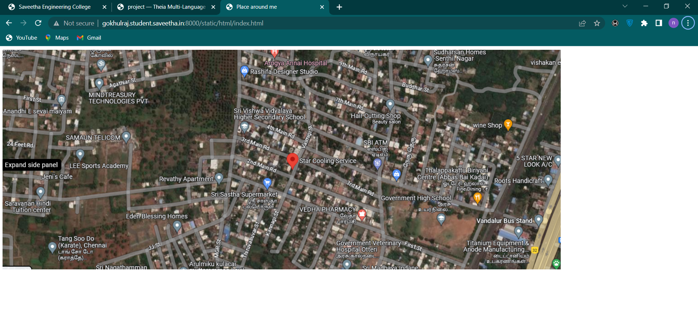
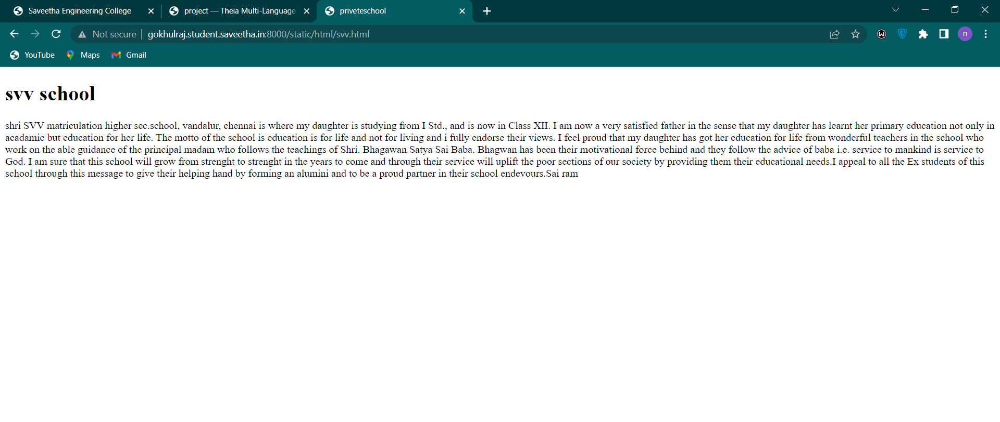
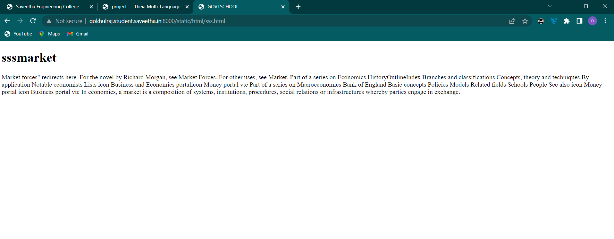
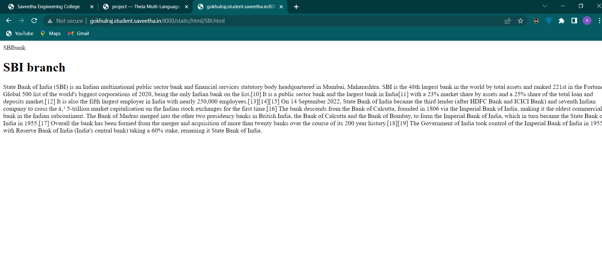
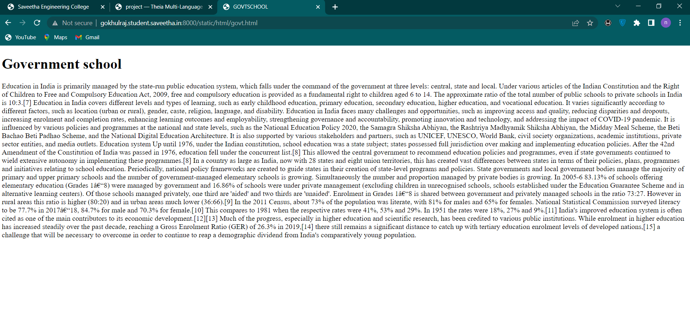
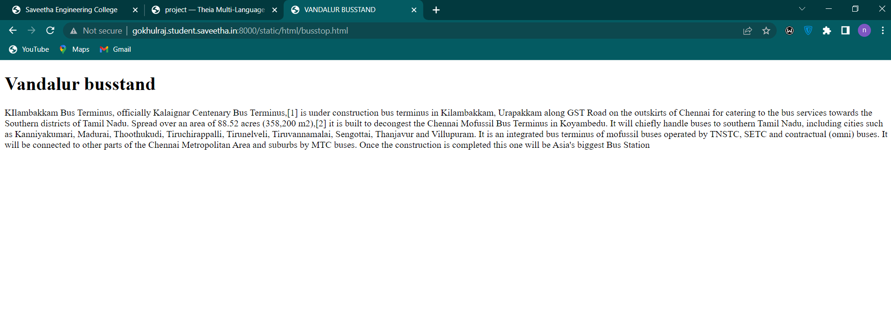

# Places Around Me
## AIM:
To develop a website to display details about the places around my house.

## Design Steps:

### Step 1:
Write your own steps here.
### Step 2:

## Code:
### map code
```html
<!DOCTYPE html>
<html>
<head>
    <title>Place around me</title>
</head>
<body>

<map name="image-maps-2023-07-22-145341" id="ImageMapsCom-image-maps-2023-07-22-145341">
<area  alt="" title="svv school" href="svv.html" shape="rect" coords="508,152,558,202" style="outline:none;" target="_self"     />
<area  alt="" title="govt school" href="govt.html" shape="rect" coords="946,353,996,403" style="outline:none;" target="_self"     />
<area  alt="" title="sbi bank" href="SBI.html" shape="rect" coords="807,224,857,274" style="outline:none;" target="_self"     />
<area  alt="" title="busstop" href="busstop.html" shape="rect" coords="1152,363,1202,413" style="outline:none;" target="_self"     />
<area  alt="" title="sss market" href="sss.html" shape="rect" coords="557,279,606,329" style="outline:none;" target="_self"     />
<area shape="rect" coords="1224,481,1226,483" alt="Image Map" style="outline:none;" title="Image Map" href="https://www.image-maps.com/" />
</map>
</body>
</html>
```

### busstop code
```html
<!DOCTYPE html>
<html>
<head>
    <title>VANDALUR BUSSTAND</title>
</head>
<body>
<h1>Vandalur busstand</h1>
<p>
KIlambakkam Bus Terminus, officially Kalaignar Centenary Bus Terminus,[1] is under construction bus terminus in Kilambakkam, Urapakkam along GST Road on the outskirts of Chennai for catering to the bus services towards the Southern districts of Tamil Nadu. Spread over an area of 88.52 acres (358,200 m2),[2] it is built to decongest the Chennai Mofussil Bus Terminus in Koyambedu. It will chiefly handle buses to southern Tamil Nadu, including cities such as Kanniyakumari, Madurai, Thoothukudi, Tiruchirappalli, Tirunelveli, Tiruvannamalai, Sengottai, Thanjavur and Villupuram. It is an integrated bus terminus of mofussil buses operated by TNSTC, SETC and contractual (omni) buses. It will be connected to other parts of the Chennai Metropolitan Area and suburbs by MTC buses. Once the construction is completed this one will be Asia's biggest Bus Station

</p>
</body>
</html>
```
### govt code
```html
<!DOCTYPE html>
<html>
<head>
    <title>GOVTSCHOOL</title>
</head>
<body>
<h1>Government school</h1>
<p>
Education in India is primarily managed by the state-run public education system, which falls under the command of the government at three levels: central, state and local. Under various articles of the Indian Constitution and the Right of Children to Free and Compulsory Education Act, 2009, free and compulsory education is provided as a fundamental right to children aged 6 to 14. The approximate ratio of the total number of public schools to private schools in India is 10:3.[7]

Education in India covers different levels and types of learning, such as early childhood education, primary education, secondary education, higher education, and vocational education. It varies significantly according to different factors, such as location (urban or rural), gender, caste, religion, language, and disability.

Education in India faces many challenges and opportunities, such as improving access and quality, reducing disparities and dropouts, increasing enrolment and completion rates, enhancing learning outcomes and employability, strengthening governance and accountability, promoting innovation and technology, and addressing the impact of COVID-19 pandemic. It is influenced by various policies and programmes at the national and state levels, such as the National Education Policy 2020, the Samagra Shiksha Abhiyan, the Rashtriya Madhyamik Shiksha Abhiyan, the Midday Meal Scheme, the Beti Bachao Beti Padhao Scheme, and the National Digital Education Architecture. It is also supported by various stakeholders and partners, such as UNICEF, UNESCO, World Bank, civil society organizations, academic institutions, private sector entities, and media outlets.

Education system
Up until 1976, under the Indian constitution, school education was a state subject; states possessed full jurisdiction over making and implementing education policies. After the 42nd Amendment of the Constitution of India was passed in 1976, education fell under the concurrent list.[8] This allowed the central government to recommend education policies and programmes, even if state governments continued to wield extensive autonomy in implementing these programmes.[8] In a country as large as India, now with 28 states and eight union territories, this has created vast differences between states in terms of their policies, plans, programmes and initiatives relating to school education. Periodically, national policy frameworks are created to guide states in their creation of state-level programs and policies. State governments and local government bodies manage the majority of primary and upper primary schools and the number of government-managed elementary schools is growing. Simultaneously the number and proportion managed by private bodies is growing. In 2005-6 83.13% of schools offering elementary education (Grades 1–8) were managed by government and 16.86% of schools were under private management (excluding children in unrecognised schools, schools established under the Education Guarantee Scheme and in alternative learning centers). Of those schools managed privately, one third are 'aided' and two thirds are 'unaided'. Enrolment in Grades 1–8 is shared between government and privately managed schools in the ratio 73:27. However in rural areas this ratio is higher (80:20) and in urban areas much lower (36:66).[9]

In the 2011 Census, about 73% of the population was literate, with 81% for males and 65% for females. National Statistical Commission surveyed literacy to be 77.7% in 2017–18, 84.7% for male and 70.3% for female.[10] This compares to 1981 when the respective rates were 41%, 53% and 29%. In 1951 the rates were 18%, 27% and 9%.[11] India's improved education system is often cited as one of the main contributors to its economic development.[12][13] Much of the progress, especially in higher education and scientific research, has been credited to various public institutions. While enrolment in higher education has increased steadily over the past decade, reaching a Gross Enrolment Ratio (GER) of 26.3% in 2019,[14] there still remains a significant distance to catch up with tertiary education enrolment levels of developed nations,[15] a challenge that will be necessary to overcome in order to continue to reap a demographic dividend from India's comparatively young population.

</p>
</body>
</html>
```

### SBI code
```html
<!DOCTYPE html>
<html>
    <head>
        <tittle>SBIbank</tittle>
    </head>
    <body>
        <h1>SBI branch</h1>
        <p>
State Bank of India (SBI) is an Indian multinational public sector bank and financial services statutory body headquartered in Mumbai, Maharashtra. SBI is the 48th largest bank in the world by total assets and ranked 221st in the Fortune Global 500 list of the world's biggest corporations of 2020, being the only Indian bank on the list.[10] It is a public sector bank and the largest bank in India[11] with a 23% market share by assets and a 25% share of the total loan and deposits market.[12] It is also the fifth largest employer in India with nearly 250,000 employees.[13][14][15] On 14 September 2022, State Bank of India became the third lender (after HDFC Bank and ICICI Bank) and seventh Indian company to cross the ₹ 5-trillion market capitalisation on the Indian stock exchanges for the first time.[16]

The bank descends from the Bank of Calcutta, founded in 1806 via the Imperial Bank of India, making it the oldest commercial bank in the Indian subcontinent. The Bank of Madras merged into the other two presidency banks in British India, the Bank of Calcutta and the Bank of Bombay, to form the Imperial Bank of India, which in turn became the State Bank of India in 1955.[17] Overall the bank has been formed from the merger and acquisition of more than twenty banks over the course of its 200 year history.[18][19] The Government of India took control of the Imperial Bank of India in 1955, with Reserve Bank of India (India's central bank) taking a 60% stake, renaming it State Bank of India.

        </p>
    </body>
</html>
```

### sss code
```html
<!DOCTYPE html>
<html>
<head>
    <title>GOVTSCHOOL</title>
</head>
<body>
<h1>sssmarket</h1>
<p>

Market forces" redirects here. For the novel by Richard Morgan, see Market Forces. For other uses, see Market.Part of a series Economics
HistoryOutlineIndex
Branches and classifications
Concepts, theory and techniques
By application
Notable economists
Lists
icon Business and Economics portalicon Money portal
vte
Part of a series on
Macroeconomics
Bank of England
Basic concepts
Policies
Models
Related fields
Schools
People
See also
icon Money portal
icon Business portal
vte
In economics, a market is a composition of systems, institutions, procedures, social relations or infrastructures whereby parties engage in exchange. 
</p>
</body>
</html>
```

### svv code
```html
<!DOCTYPE html>
<html>
<head>
    <title>priveteschool</title>
</head>
<body>
<h1>svv school</h1>
<p>

shri SVV matriculation higher sec.school, vandalur, chennai is where my daughter is studying from I Std., and is now in Class XII. I am now a very satisfied father in the sense that my daughter has learnt her primary education not only in acadamic but education for her life. The motto of the school is education is for life and not for living and i fully endorse their views. I feel proud that my daughter has got her education for life from wonderful teachers in the school who work on the able guidance of the principal madam who follows the teachings of Shri. Bhagawan Satya Sai Baba. Bhagwan has been their motivational force behind and they follow the advice of baba i.e. service to mankind is service to God. I am sure that this school will grow from strenght to strenght in the years to come and through their service will uplift the poor sections of our society by providing them their educational needs.I appeal to all the Ex students of this school through this message to give their helping hand by forming an alumini and to be a proud partner in their school endevours.Sai ram

</p>
</body>
</html>
```
## Output:

### mapoutput


### svvoutput


### sssoutput


### SBIoutput


### govtoutput


### busstopoutput


## Result:
The program is execute successfully.
